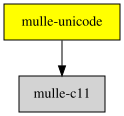

# mulle-unicode

#### 🈚 Unicode ctype like library

a C (C99) library to classify and convert unicode characters, based on the
Unicode 3.0.0 specification.
The library uses the Unicode specification data to create C code.
mulle-unicode is fairly compact for what it does, compiling down to around
256KB.

`𓀀𓋹𓂻𓆑`


| Release Version                                       | Release Notes  | AI Documentation
|-------------------------------------------------------|----------------|---------------
|  [](//github.com/mulle-c/mulle-unicode/actions)  | [RELEASENOTES](RELEASENOTES.md) | [DeepWiki for mulle-unicode](https://deepwiki.com/mulle-c/mulle-unicode)


## API

| File                             | Description
|----------------------------------| ----------------------------------------
| [`Ctype`](dox/API_CTYPE.md)      | `<ctype.h>` like functionality for UTF32 and UTF16 strings
| [`Conversion`](dox/API_CTYPE.md) | Converting strings back and forth


## Documentation & Guides

* [API Summary](asset/dox/api/toc)


### You are here




## Add

mulle-unicode is a component of the [mulle-core](//github.com/mulle-core/mulle-core) library. So in your code include the mulle-core umbrella header:

``` c
#include <mulle-core/mulle-core.h>
```

### Add mulle-core to a cmake and git project

``` bash
git submodule add https://github.com/mulle-core/mulle-core.git mulle-core
```

Add this to your `CMakeLists.txt`:

``` cmake
add_subdirectory( mulle-core)
target_link_libraries( ${PROJECT_NAME} PRIVATE mulle-core)
```


### Add mulle-core to a mulle-sde project

``` sh
mulle-sde add github:mulle-core/mulle-core
```

### Embed mulle-unicode with clib

``` sh
clib install --out src mulle-c/mulle-unicode
```

Append `src` to your include path (e.g. add `-isystem src`  to your `CFLAGS`)
and compile all the sources that were downloaded.


## Author

[Nat!](https://mulle-kybernetik.com/weblog) for Mulle kybernetiK  


