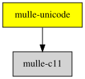

# mulle-unicode

#### 🈚 Unicode ctype like library

a C (C99) library to classify and convert unicode characters, based on the
Unicode 12.1 specification.
The library uses the Unicode specification data to create C code.
mulle-unicode is fairly compact for what it does, compiling down to around
256KB.

`𓀀𓋹𓂻𓆑`


| Release Version                                       | Release Notes  | AI Documentation
|-------------------------------------------------------|----------------|---------------
|  [](//github.com/mulle-c/mulle-unicode/actions)  | [RELEASENOTES](RELEASENOTES.md) | [DeepWiki for mulle-unicode](https://deepwiki.com/mulle-c/mulle-unicode)


## API

| File                             | Description
|----------------------------------| ----------------------------------------
| [`Ctype`](dox/API_CTYPE.md)      | `<ctype.h>` like functionality for UTF32 and UTF16 strings
| [`Conversion`](dox/API_CONVERSION.md) | Simple case conversion (tolower, toupper, totitlecase)


## Documentation & Guides

* [API Summary](asset/dox/api/toc)


### You are here




## Add

### Add mulle-unicode via mulle-core

mulle-unicode is a component of the
[mulle-core](//github.com/mulle-core/mulle-core) library.
In your code include its umbrella header:

``` c
#include <mulle-core/mulle-core.h>
```

In your project add mulle-core as a git submodule and link against it:

``` bash
git submodule add -f "https://github.com/mulle-core/mulle-core.git" \
                     "stash/mulle-core"
git submodule update --init --recursive
```

then add these comands to your `CMakeLists.txt`:

``` cmake
include_directories( SYSTEM "stash/mulle-core/src")
add_subdirectory( stash/mulle-core)
target_link_libraries( ${PROJECT_NAME} PUBLIC mulle-core)
```

Or let [mulle-sde](//github.com/mulle-sde) do it:

``` sh
mulle-sde add mulle-core/mulle-core
```


### Add mulle-unicode as a cmake subproject

In your code include its header:

``` c
#include <mulle-unicode/mulle-unicode.h>
```

Add mulle-unicode and dependencies as git submodules and link against
them:

``` bash
git submodule add -f --name "mulle-c11" \
                            "https://github.com/mulle-c/mulle-c11.git" \
                            "stash/mulle-c11"
git submodule add -f --name "mulle-unicode" \
                        "https://github.com/mulle-c/mulle-unicode" \
                        "stash/mulle-unicode"
git submodule update --init --recursive
```

``` cmake
include_directories( SYSTEM "${CMAKE_BINARY_DIR}/include")

add_subdirectory( stash/mulle-c11)
add_subdirectory( stash/mulle-unicode)

target_link_libraries( ${PROJECT_NAME} PUBLIC mulle-c11)
target_link_libraries( ${PROJECT_NAME} PUBLIC mulle-unicode)
```

Or let [mulle-sde](//github.com/mulle-sde) do it:

``` sh
mulle-sde add github:mulle-c/mulle-unicode
```

## Individual Install

Install all the prerequisites.

``` bash
PREFIX=/tmp/usr/local
BUILD_DIR="mulle-unicode/build"

cmake -S "mulle-unicode" -B "${BUILD_DIR}"    \
  -DCMAKE_BUILD_TYPE="Release"                  \
  -DCMAKE_INSTALL_PREFIX="${PREFIX}"            \
  -DCMAKE_PREFIX_PATH="${PREFIX}"               \
  -DCMAKE_C_FLAGS="-I"${PREFIX}"/include"       \
&& cmake --build "${BUILD_DIR}"  --parallel     \
&& cmake --install "${BUILD_DIR}"
```


## Author

[Nat!](https://mulle-kybernetik.com/weblog) for Mulle kybernetiK  


