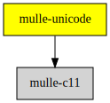

# mulle-unicode

#### 🈚 Unicode ctype like library

a C (C99) library to classify and convert unicode characters, based on the
Unicode 3.0.0 specification.
The library uses the Unicode specification data to create C code.
mulle-unicode is fairly compact for what it does, compiling down to around
256KB.

`𓀀𓋹𓂻𓆑`


| Release Version                                       | Release Notes  | AI Documentation
|-------------------------------------------------------|----------------|---------------
|  [](//github.com/mulle-c/mulle-unicode/actions)  | [RELEASENOTES](RELEASENOTES.md) | [DeepWiki for mulle-unicode](https://deepwiki.com/mulle-c/mulle-unicode)


## API

| File                             | Description
|----------------------------------| ----------------------------------------
| [`Ctype`](dox/API_CTYPE.md)      | `<ctype.h>` like functionality for UTF32 and UTF16 strings
| [`Conversion`](dox/API_CTYPE.md) | Converting strings back and forth


### You are here




## Add

**This project is a component of the [mulle-core](//github.com/mulle-core/mulle-core) library. As such you usually will *not* add or install it
individually, unless you specifically do not want to link against
`mulle-core`.**


### Add as an individual component

Use [mulle-sde](//github.com/mulle-sde) to add mulle-unicode to your project:

``` sh
mulle-sde add github:mulle-c/mulle-unicode
```

To only add the sources of mulle-unicode with dependency
sources use [clib](https://github.com/clibs/clib):


``` sh
clib install --out src/mulle-c mulle-c/mulle-unicode
```

Add `-isystem src/mulle-c` to your `CFLAGS` and compile all the sources that were downloaded with your project.


## Install

Use [mulle-sde](//github.com/mulle-sde) to build and install mulle-unicode and all dependencies:

``` sh
mulle-sde install --prefix /usr/local \
   https://github.com/mulle-c/mulle-unicode/archive/latest.tar.gz
```

### Legacy Installation

Install the requirements:

| Requirements                                 | Description
|----------------------------------------------|-----------------------
| [mulle-c11](https://github.com/mulle-c/mulle-c11)             | 🔀 Cross-platform C compiler glue (and some cpp conveniences)

Download the latest [tar](https://github.com/mulle-c/mulle-unicode/archive/refs/tags/latest.tar.gz) or [zip](https://github.com/mulle-c/mulle-unicode/archive/refs/tags/latest.zip) archive and unpack it.

Install **mulle-unicode** into `/usr/local` with [cmake](https://cmake.org):

``` sh
PREFIX_DIR="/usr/local"
cmake -B build                               \
      -DMULLE_SDK_PATH="${PREFIX_DIR}"       \
      -DCMAKE_INSTALL_PREFIX="${PREFIX_DIR}" \
      -DCMAKE_PREFIX_PATH="${PREFIX_DIR}"    \
      -DCMAKE_BUILD_TYPE=Release &&
cmake --build build --config Release &&
cmake --install build --config Release
```


## Author

[Nat!](https://mulle-kybernetik.com/weblog) for Mulle kybernetiK  


